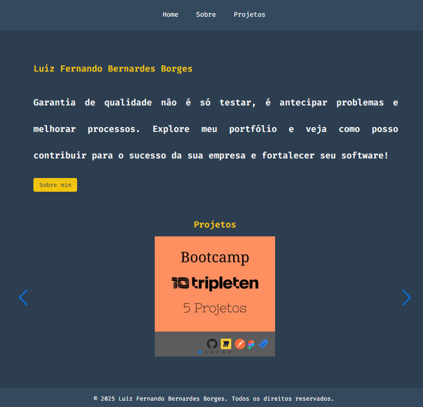

# README

Este projeto é um site de portfólio pessoal desenvolvido para exibir meus projetos, habilidades e experiências como QA. Utilizando tecnologias modernas como Next.js, React e Swiper, criei uma plataforma interativa e responsiva que destaca meus trabalhos e conhecimentos.

O site foi construído do zero, desde a estruturação do front-end até a implementação de testes automatizados com Cypress e Jest, garantindo qualidade e performance. Além de ser uma vitrine profissional, este projeto representou um grande desafio e aprendizado, permitindo-me explorar novas ferramentas e consolidar meus conhecimentos em desenvolvimento e qualidade de software.

## Destaques:
- Tecnologias: Next.js, React, Swiper, Cypress.
- Testes Automatizados: Garantia de qualidade com testes e2e e unitários.
- Responsivo e Acessível: Design adaptável para diferentes dispositivos.
- Deploy Automático: Hospedagem na Vercel com integração contínua via GitHub Actions.

Este projeto não apenas demonstra minhas habilidades técnicas, mas também minha capacidade de aprender e aplicar novas tecnologias, algo essencial para minha trajetória como QA.

## Tecnologias Utilizadas

1. Linguagens de Programação:
    - JavaScript
    - HTML/CSS
2. Frameworks:
    - Next.js
    - React
3. Bibliotecas:
    - Swiper (carousel)
    - React Modal (modais)
    - CSS Modules (estilização)
4. Ferramentas de Testes:
    - Cypress (testes e2e)
    - Jest (testes unitários)
    - React Testing Library (testes de integração)
5. Ferramentas de Desenvolvimento:
    - Git/GitHub
    - VSCode
    - ESLint/Prettier
6. Hospedagem e CI/CD:
    - Vercel
    - GitHub Actions

## Como Rodar o Projeto

1. Pré-requisitos:
    - Node.js instalado (versão 16 ou superior).
    - Git instalado.
2. Clonar o Repositório:
    `https://github.com/LFernandoBernardes/meu-portfolio`
3. Instalar Dependências:
    `npm install`
4. Rodar o Projeto Localmente:
    `npm run dev`
    - O projeto estará disponível em http://localhost:3000.
5. Rodar Testes:
    - Testes Unitários:
       `npm test`
    - Testes End-to-End (Cypress):
        `npx cypress open`
6. Build e Deploy:
    - Para build:
        `npm run build`
    - O deploy é automático via Vercel ao fazer push na branch main.

### Estrutura do Projeto
- `/components`: Componentes reutilizáveis do React.
- `/pages`: Rotas do Next.js.
- `/public`: Arquivos estáticos (imagens, fonts).
- `/styles`: Estilos CSS Modules.
- `/cypress`: Testes end-to-end.
- `/__tests__`: Testes unitários e de integração.
  
### Contribuição
- Sinta-se à vontade para abrir issues ou pull requests com melhorias e correções.
  
### Autor

- Luiz Fernando Bernardes Borges - Analista de Qualidade de Software
